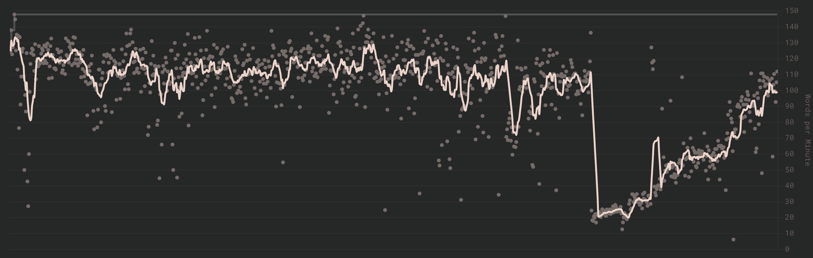

เพิ่งนึกขึ้นได้ว่าไม่ได้เขียนบล็อคมานานมากๆ ก็เลยอยากมาเพิ่มคอนเทนต์นิดหน่อย โดยเรื่องที่มีการเปลี่ยนแปลงที่สุดในตอนนี้
ก็น่าจะเป็นเรื่องการเปลี่ยน layout keyboard นี่แหละ 555

วันนี้ก็เลยอยากจะมาเล่าประสบการณ์การใช้งาน colemak-dh มา 7 เดือน เหตุผลที่เปลี่ยน และก็คำแนะนำสำหรับคนที่สนใจเปลี่ยน layout มาใช้งานด้วย

## ทำไมถึงเปลี่ยนล่ะ?

คือต้องเท้าความกันก่อนว่าช่วงนั้นเพื่อนๆ ในกลุ่มรวมถึงผมเองอยู่ดีๆ ก็เริ่มบ้า ergonomic ขึ้นมา คืออยากจะซื้อพวก
split keyboard กันมากๆ เพราะอยากจะรักษาสุขภาพมือมากขึ้น ซึ่งตอนนั้นเหมือนจะมีบางคนที่แอบมีอาการปวดมือบ้างแล้วด้วย

ซึ่งไอการที่บ้า ergonomic นี่แหละทำให้มันขยับมาเรื่อยๆ เป็นเปลี่ยน layout ไปด้วยเลยจะได้ครบๆ
เพราะหลายๆ คนก็แนะนำว่าถ้าจะใช้ ergonomic keyboard ก็ควรจะเปลี่ยน layout มาใช้งานด้วย
เพราะ QWERTY มันไม่ค่อยจะมีกับคีย์บอร์ดแนวนี้เท่าไหร่

ส่วนตัวผมเหนี่ย คือจริงๆ แล้วผมก็ไม่ได้มีอาการปวดมืออะไรอยู่แล้ว แค่อยากจะเล่น split keyboard เฉยๆ 555
แล้วปัญหานึงที่เจอคือวิธีการพิมพ์ของผมใน layout QWERTY เหนี่ยมันไม่ได้เป็น touch typing จริงๆ
ทำให้การย้ายไปใช้ split keyboard นี่มันเป็นเรื่องที่ยากมากๆ
ก็เลยตัดสินใจว่าถ้าจะฝึกพิมพ์ใหม่หมด ก็เลือก layout ใหม่ไปเลยละกัน

## ทำไมถึงเลือก colemak-dh?

จริงๆ แล้วตอนแรก layout ที่ผมเลือกมันคือ workman ครับ เพราะเมื่อก่อนรู้จักแค่ dvorak กับ workman
ก็เลยตัดสินใจเลือก workman เพราะรู้สึกว่า shortcut ของ workman มันค่อนข้างจะเหมือนเดิม

แต่พอฝึกไปสักพักนึง ก็เริ่มไปเจอคนให้ความเห็นว่า workman มันไม่ค่อยจะดีเท่าไหร่ เมื่อเทียบกับ colemak ที่
มันพยายามจะต่อยอดมา แล้วก็ส่วนใหญ่ลงความเห็นตรงกันว่า colemak-dh มันดีกว่า ก็เลยย้ายมาใช้ colemak-dh แทน

ซึ่งถ้าให้พูดเชิงลึกว่าทำไมมันแย่กว่า หลักๆ คือวงการ layout มันจะมีหลายๆ metric มากที่ใช้ในการวัดว่า layout นั้นดีหรือไม่
โดยหน่วยวัดนึงก็คือ "Same-Finger Bigrams" ซึ่งหมายถึงการกดคีย์สองคีย์ด้วยนิ้วเดียวกันแบบติดๆ กัน
ซึ่งทำให้การพิมพ์ช้าลงและไม่ smooth เท่าไหร่ ซึ่งเป็นปัญหาที่เกิดขึ้นบ่อยๆ ใน workman แต่ใน colemak-dh มันจะน้อยกว่ามากๆ

ส่วนเหตุผลที่เลือก colemak-dh มากกว่า colemak-dh เพราะมันแก้ปัญหาที่นิ้วชี้จะขยับซ้ายขวาบ่อย
ซึ่งมันทำได้ลำบากกว่าการขยับนิ้วลงมา ทำให้ colemak-dh ย้ายปุ่ม "dh" มาอยู่แถวล่าง
ซึ่งตอนแรกผมก็ไม่ได้เก็ตเท่าไหร่ แต่พอลองใช้ colemak ดูแปปๆ ก็รู้สึกว่ามันมีปัญหานี้จริงๆ แหละ

ด้วยเหตุผลเหล่านี้ ก็เลยตัดสินใจเลือกใช้ colemak-dh ตั้งแต่ตอนนั้นเลย

## การเปลี่ยน layout มันยากไหม?

จากประสบการณ์ที่ผ่านมา ในช่วงเดือนแรกนั้นถือว่าหนักพอสมควร เพราะมันเป็นช่วงที่ต้อง unlearn การพิมพ์เดิม
แล้วมา learn อันใหม่ โดยเฉพาะช่วงอาทิตย์แรกทำให้รู้สึกว่าตอนฝึกพิมพ์ในเว็บต่างๆ มันจะใช้พลังสมองเยอะมากๆ

แต่พอผ่านช่วงอาทิตย์แรกไป จะเริ่มสบายขึ้น การพิมพ์อาจจะยังช้าอยู่ (20-30 WPM) แต่ไม่ได้ใช้พลังสมองเยอะแล้ว
ซึ่งก็ถือว่าเป็นช่วงที่สามารถเปลี่ยนมาใช้ layout ใหม่ได้เลยในชีวิตประจำวัน
ช่วงนั้นก็เริ่มจะรู้สึกว่าการพิมพ์มันสนุกขึ้น รู้สึกว่าการพิมพ์มันใช้ effort น้อยลงมากๆ
ซึ่งเป็นความรู้สึกที่เกิดขึ้นครั้งสุดท้ายก็คือตอนฝึก QWERTY นั่นแหละ 555

พอผ่านเดือนไปแล้ว ก็ความเร็วมันก็จะเพิ่มขึ้นมาเรื่อยๆ โดยเดือนแรกๆ จะอยู่ที่ 50-60 WPM
ซึ่งถึงจุดนั้นก็ถือว่าสามารถใช้ทำงานต่างหรือเขียนโค้ดได้แบบปกติแล้ว อาจจะไม่ได้เร็วเท่าเดิม
แต่เอาเข้าจริงๆ ความเร็วสูงกว่านี้มันก็ไม่ได้มีผลเยอะขนาดนั้น

## ฝึกพิมพ์ยังไง?

โดยหลักๆ ผมจะแบ่งเป็นสองช่วง ช่วงแรกคือช่วงที่มาเรียนรู้ layout ใหม่ ซึ่งจะค่อยๆ ไล่ฝึกเป็นคีย์ๆ ไป
โดยเว็บที่ใช้ในช่วงนี้คือ [colemakclub](https://gnusenpai.net/colemakclub/) ซึ่งข้อดีมันคือ
มันจะแบ่งการฝึกเป็น levelๆ ไป แล้วเราก็ไม่ต้องเปลี่ยน layout ในเครื่องเรา เพราะมัน emulate ได้
ซึ่งที่ผมทำคือจะฝึก level นั้นๆ จนกว่าจะจำต่ำแหน่งปุ่มได้ แล้วค่อยไป level ถัดไป
อันนี้ผมจะเน้นแค่ว่าให้จำ layout ได้ ไม่จำเป็นต้องเร็วหรือถูกเป๊ะๆ

อีก setting นึงที่ผมปรับไว้คือปรับให้มันไม่ต้อง register การพิมพ์ผิด เพราะว่าในช่วงแรกๆ มันจะพิมพ์ผิดบ่อยมาก
ทำให้เสียเวลามานั่งลบมากกว่าจะได้พิมพ์ ซึ่งส่วนตัวจะปรับแบบนี้ในทุกเว็บจนรู้สึกว่าเข้ามือแล้วค่อยเอาออก

แล้วหลังจากที่จำ layout ได้แล้ว ก็จะเริ่มฝึกพิมพ์จริงๆ โดยช่วงนี้คือผมเปลี่ยน layout ในเครื่องเป็น colemak-dh
ไปเลย แล้วให้การใช้งานปกติเป็นการฝึกในตัว แล้วก็เอาเวลาที่ว่างๆ มาปั่น [monkeytype](https://monkeytype.com/)
ไป ซึ่งเป็นเว็บประจำที่ผมชอบมานั่งพิมพ์เล่นทุกวันอยู่แล้ว โดยในเว็บผมจะปรับเวลาเป็น infinite
เพราะอยากได้ feel การพิมพ์มากกว่าพยายามเพิ่มความเร็ว

พอในช่วงหลังๆ ก็เริ่มสลับระหว่างมีเวลากับไม่มีเวลา แล้วแต่อารมณ์ไป โดยในช่วงนี้ก็คือจะพัฒนาความเร็วนั่นแหละ
ในช่วงนี้ก็จะเป็นช่วงที่มันร่ายยาวมาเรื่อยๆ จนถึงวันนี้นี่แหละ อันนี้จริงๆ ก็เป็นมาตั้งแต่ QWERTY แล้วที่วิธีการทำให้พิมพ์ได้เร็วขึ้นก็คือ
การฝึกมันทุกวันเป็นเวลานานๆ อยู่แล้ว

## ประสบการณ์การใช้งานในชีวิตประจำวัน

โดยรวมๆแล้ว ก็คืออย่างที่บอกว่าจะเห็นผลได้ชัดตั้งแต่เดือนแรกๆ แล้ว โดยมันทำให้เรารู้สึกว่าเราขยับนิ้วน้อยลง
นิ้วไม่เกร็ง สามารถพิมพ์เป็นเวลานานๆ ได้ โดยเทียบกับ QWERTY เวลาผมเล่น monkeytype นานๆ จะรู้สึกล้านิ้วพอสมควร
แต่ colemak-dh ผมเล่นได้เรื่อยๆ เลย ซึ่งมันเป็นความรู้สึกที่ดีมากๆ

ในเรื่องความเร็ว อันนี้ในฐานะที่ผมฝึก speed typing ใน QWERTY มาเยอะมากๆ ถ้าให้พูดตรงๆ ก็คือ colemak-dh ไม่ได้ทำให้เราพิมพ์ได้เร็วขึ้น
และผมก็มั่นใจว่าผมพิมพ์ QWERTY ได้เร็วกว่าแน่นอน เพราะถึงแม้ว่าวิธีการพิมพ์ผมมันจะผิด แต่เพราะว่าการวางนิ้วที่มัน freestyle
นี่แหละที่ทำให้สามารถพิมพ์ได้เร็วขึ้น เพราะเราสามารถเลือกที่จะวางนิ้วในจุดแปลกๆ ที่ทำให้เรากดปุ่มแบบติดๆกันได้
แต่อันนี้คือในระดับที่มันเร็วมากๆ แบบ 120 WPM++ ซึ่งถ้าให้พูดตรงๆอีก ก็คือมันไม่ได้ใช้ในการพิมพ์ทั่วไปแล้ว
เพราะความเร็วระดับนั้นคือเราพิมพ์ามสิ่งที่เห็น ไม่ใช่สิ่งที่เราคิด และเราก็ไม่ได้คิดเร็วขนาดนั้น ทำให้ถ้าแตะช่วง 100 WPM ได้ก็คือว่าพอแล้ว

อีกเรื่องคือพอเราได้พิมพ์แบบถูกวิธีจริงๆ การปรับมาใช้ split keyboard หรือพวกทรง alice คือสามารถพิมพ์ได้เลยทันที
ซึ่งต่างจาก QWERTY หรือภาษาไทยที่ผมพิมพ์แบบผิดๆ ที่จะรู้สึกปวดหัวมากๆเวลาพิมพ์

## ปัญหาที่เจอ

หลังจากใช้มา 7 เดือน ก็จะเจอปัญหามาพอสมควร ทั้งใหญ่และเล็ก ซึ่งผมว่าน่าจะเจอครบทุกอย่างแล้วแหละ

1. **ลืมวิธีการเขียน QWERTY** -
   อันนี้ถือว่าเป็นปัญหาที่ใหญ่ที่สุดแล้ว เพราะตอนนี้คือผมต้องมองคีย์บอร์ดเวลาพิมพ์ QWERTY ไม่งั้นพิมพ์ไม่ได้เลย ซึ่งจะเป็ฯปัญหามากๆ
   เวลาไปใช้คอมคนอื่น หรือแม้กระทั่งตอน set up VM หรือคอมใหม่ จริงๆ อันนี้มองว่าสามารถแก้ได้โดยการกลับมาฝึก QWERTY สลับไปมา
   แต่ยังดีคือสามารถใช้ keyboard ในโทรศัพท์ได้ปกติ (แล้วก็ไม่แนะนำให้เปลี่ยนด้วย) เพราะวิธีการพิมพ์มันไม่เหมือนกัน ก็เลยรอดไป
2. **ต้องมาโหลด layout ใน Windows/MacOS** -
   อันนี้ก็เป็นปัญหาที่เล็กๆ น้อยๆ ที่เราต้องมาโหลด layout มาใช้งาน แต่ก็ไม่ใช่ปัญหาอะไรมาก อาจจะงงในช่วงแรกว่าต้องทำยังไง
   แต่ก็มีข้อสังเกตุนึงคือ Linux เหมือนจะใช้ได้โดยไม่ต้องลงอะไรเพิ่มเลย ก็ถือว่าดี
3. **Vim** -
   ส่วนตัวคือไม่ได้ใช้ Vim (ขอโทษครับทุกคน ผม skill issue) แต่มาเริ่มฝึกใช้หลังจากเปลี่ยน layout แล้ว ความรู้สึกคือน่าจะเป็น
   ปัญหากับคนที่ใช้มาก่อนแล้วที่ต้องมาจำใหม่ แต่ต่อให้ฝึกใหม่ก็มีปัญหา
   เพราะไอการใช้ hjkl มันแปลกมากๆ ทำให้วิธีแก้ของผมคือต้องไปนั่งหาการทำ layer keyboard มาใช้งาน ข้อดีคือพอผมทำเสร็จ
   ผมก็ใช้มันทักที่เลย กลายเป็นว่าผมเลิกใช้ arrow key ไปเลยถ้าไม่จำเป็น ถึงแม้ว่าจะใช้ Zed ก็เขียนโค้ดก็เหอะ
4. **Shortcut** -
   เอาจริงๆ การฝึก shortcut ใหม่ไม่ได้เป็นปัญหา แต่ปัญหาคือ shortcut มันจะเป็นเหมือนเดิมเวลาเราใช้ภาษาไทย
   ทำให้เวลาเรากลับมาใช้ภาษาไทย ก็จะงงๆ
5. **การเล่นเกม** -
   อันนี้ถือว่าเป็นปัญหาเล็กน้อย แต่ก็รำคาญบ้าง เพราะหลายๆเกมมันตั้ง keybind ตาม QWERTY ทำให้เวลาเล่นเกมต้องไปเปลี่ยน layout
   เป็น QWERTY ทำให้จะงงๆ บ้างเวลาจะพิมพ์ในเกม แต่ก็ไม่ใช่ปัญหาใหญ่มาก และก็มีเกมที่สามารถใช้ layout อื่นได้เลย
   โดยที่เจอคือเกมจาก valve กับ minecraft ที่สามารถใช้ได้เลย

## Finale

หลักๆ ก็คืออยากจะบอกว่า ถ้าเป็นไปได้ ไม่ได้มี contraint อะไร หรือเริ่มรู้สึกว่ามีปัญหากับการพิมพ์
ก็อยากจะให้ทุกคนลองเปลี่ยน layout มาใช้ดู อาจจะไม่ต้องรีบเปลี่ยนทั้งหมด แต่ลองผ่านเว็บเรื่อยๆ
เพราะผมมองว่ามันเป็นประสบการณ์ที่ดีแบบก้าวกระโดดจาก QWERTY จริงๆ
ถ้าลองแล้วรู้สึกว่าไม่ได้จริงๆ ก็ไม่เป็นไร กลับไปใช้ QWERTY ก็ไม่ได้เสียหายอะไร
