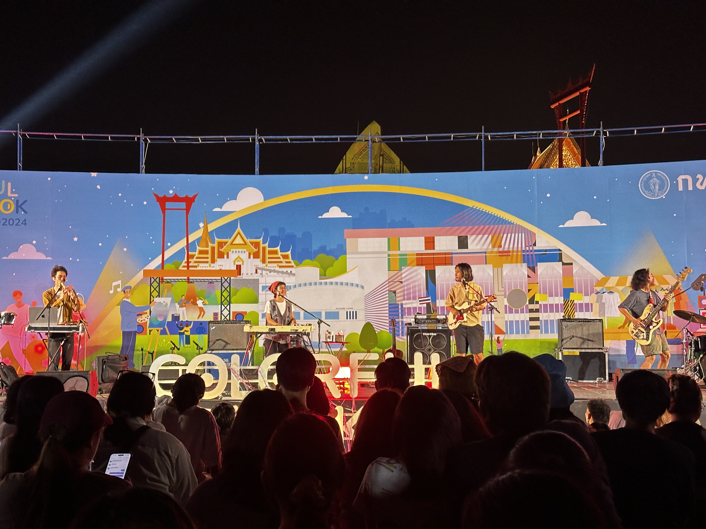

ความอู๋ม่งต๊ะของผมวันนี้คื อตอนแรกก็เห็นโพสต์งานนี้มาประมาณสักอาทิตย์นิด ๆ ได้แล้ว แต่เหมือนจำไม่ได้ว่าช่วงไหน ก็เลยพลาดช่วงวันแรก ๆ ไป ซึ่งก็พลาด LANDOKMAI ไป 😭 แล้วก็จำไม่ได้ด้วยว่า **Plastic Plastic** จะมา เพิ่งมาเห็นตอนวงโพสต์ในเฟสว่าขึ้นทุ่มนึงตอนช่วงห้าโมงเย็นได้ ตอนนั้นก็แอบคิดว่าจะไปดีไหม (ไม่รู้ทำไมถึงคิดแบบนั้น วงอันดับหนึ่งตัวเองแท้ ๆ 5555) สุดท้ายก็ไป ซึ่งก็ถือว่าคิดถูกมาก ๆ ที่มา

## งานคนรัก art and music แนว earth tone ใจกลางย่านเมืองเก่า

นี่คงจะเป็นนิยามที่ผมว่าน่าจะเข้ากันกับงานนี้ที่สุดละ มันเหมือนงานบ้านและสวน but art แปลก ๆ มันมีความเป็น community ที่น่ารัก ๆ ในย่านเมืองเก่าที่บางมุมก็มีฟีลไทยผสมยุโรปที่เข้ากันอย่างน่าประหลาด (โดยเฉพาะแถว ๆ สวนรมณีนาถ)

โดยตัวงานเองเหนี่ยจะมีบูทที่ส่วนใหญ่จะขายของ handmade น่ารัก ๆ รวมถึง community เล็ก ๆ นิดหน่อยอย่างชาวบอร์ดเกม bgn หรือชาวการ์ตูนอย่าง Kai3 โดยรวมคือถ้าผมอยู่บ้านตัวเอง หรือมีคอนโดเป็นของตัวเอง น่าจะโดนไปไม่น้อย

ส่วนตัวเลยคือรู้สึกว่า venue แบบลานคนเมืองนี่มันเหมาะกับการจัดงานแนวนี้สุด ๆ หวังว่ากทม.จะใช้พื้นที่ตรงจัดงานบ่อย ๆ นะครับ

ปล. ลืมถ่ายรูปในงานมาจ้า 5555

## a little bit high โฟล์กดี ๆ ที่ฟังแล้วอยากบินไปเปิดฟังบนดอย

เป็นวงที่ถ้าให้ผมพูดตรง ๆ คือตอนแรกไม่ได้สนใจขนาดนั้น เพราะไม่รู้จัก ไม่รู้ด้วยซ้ำว่าเป็นแนวอะไร แต่พอได้ฟังโฟร์กดี ๆ แบบนี้ ในบรรยากาศดี ๆ แบบนี้ ก็ชอบขึ้นมาเลย ส่วนตัวคือไม่ได้ฟังแนวโฟร์กเป็นหลัก มีฟัง t_047 อัลบั้มแรก ๆ บ้างเป็นบางครั้ง แต่การได้ฟังวงนี้ก็เป็นเครื่องย้ำเตือนว่าผมก็ชอบแนวนี้นะ แค่ไม่ค่อยได้ฟังเฉย ๆ วันหลังก็ไปหาฟังบ้างนะ 5555

## Plastic Plastic กับการได้ฟังสดครั้งแรกที่ดีต่อใจเหลือเกิน

ความแอบฮานิดหน่อยคือผมก็เพิ่งซื้อบัตรงาน temp. x plastic plastic ที่จะจัดเดือนหน้าไป ตอนแรกก็นึกว่าจะได้ฟัง plastic plastic สุดที่รักครั้งแรกในงานนั้น แต่ก็โดนงานฟรีตัดหน้าไปแบบงง ๆ 5555

ส่วนตัวคือประทับใจมาก ๆ แบบประทับใจสุด ๆ ทั้งซาวด์ บรรยากาศ เครื่องเสียง การร้องของพี่เพลง การ improvise เท่ ๆ ต้องพี่ปกป้อง ทุกอย่างมันลงตัวไปหมด เสียอย่างเดียวคือตอนมีความสุข เวลามันจะผ่านไปเร็ว 🥺

ที่ชอบมาก ๆ คือปกติถ้าเป็นเพลงอัลบั้มแรก หรือเพลงเก่า ๆ แบบอยากรู้มันจะไม่ค่อยมี element สนุกหูเยอะเท่า Anything Goes แต่มารอบนี้คือใส่กันสนุกมาก โดยเฉพาะเพลงอยากรู้ที่ดีมาก ๆ แบบแสงออกหู (อีกแล้ว) คือฟังเสร็จแล้วอยากถึงงานลิโด้ไว ๆ เหลือเกิน 5555

plastic plastic น่าจะเป็นวงที่เข้ากับงานแนว ๆ นี้ที่สุดแล้วแหละ ทั้งตัว personality วงเอง ตั้งตัวเพลงเอง ถือว่าคนจัดงานนี่ตาถึงมาก ๆ (และหวังว่าจะชวนมาเล่นบ่อย ๆ นะ 5555)

