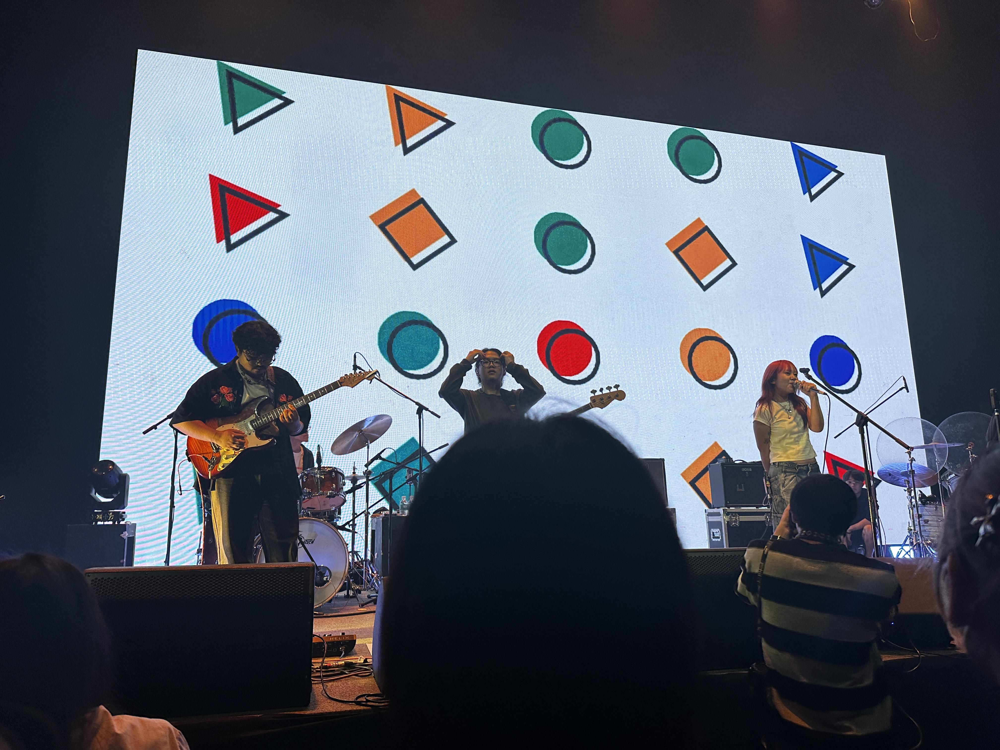
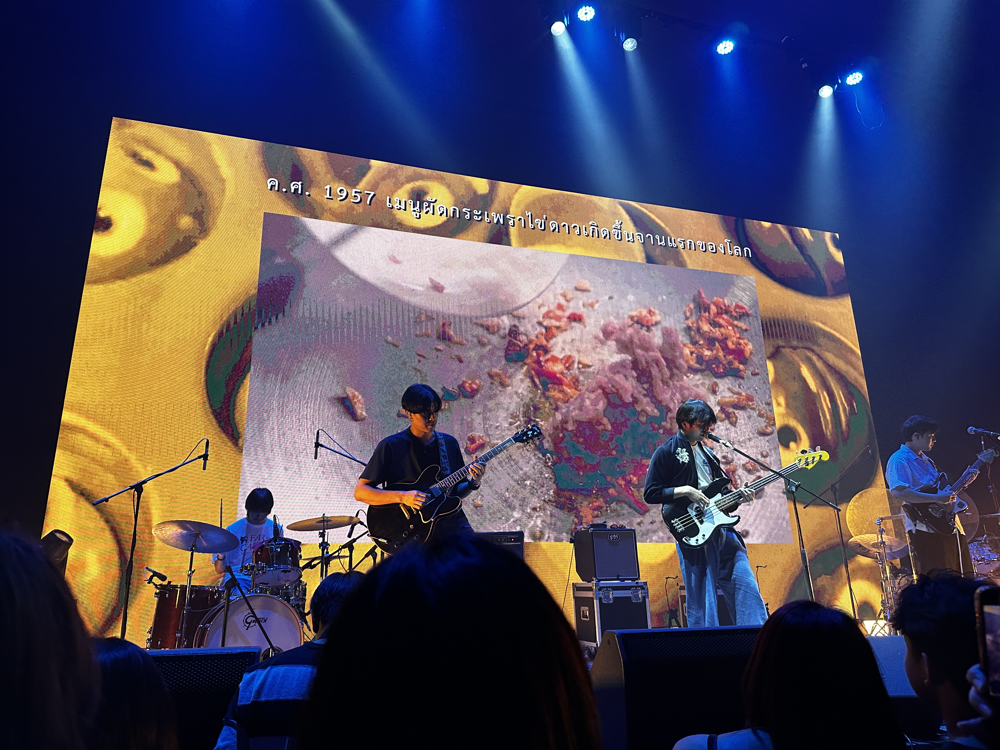
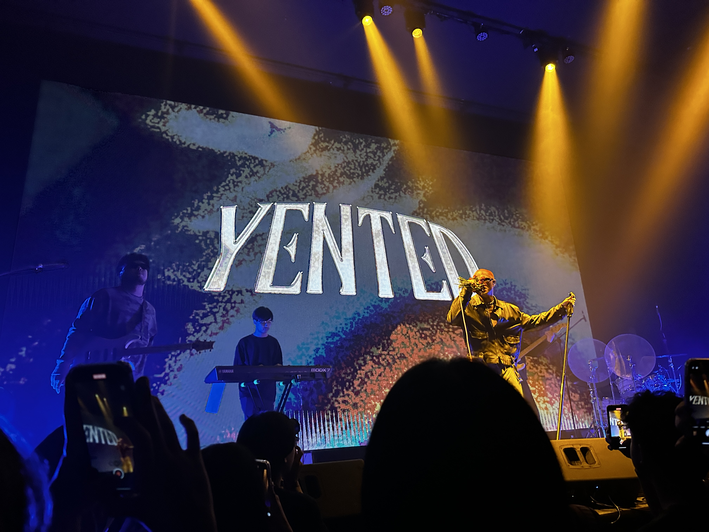
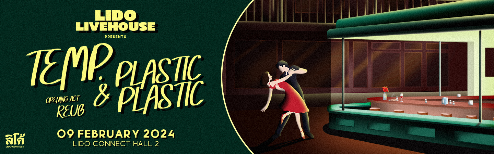

สวัสดีวันปีใหม่ย้อนหลังนะครับ เปิดปีใหม่มา ลิโด้ก็จัดของเด็ดด้วยคอนเสิร์ต YENTED & PLASUI PLASUI มาให้เสพเลยทันที นับว่าเป็นอะไรที่ว๊าวมาก ๆ (ส่วนตัวคือกดตั้งแต่วันแรกเมื่อธันวาที่ผ่านมา) ซึ่งคอนเสิร์ตก็เพิ่งจบไปร้อน ๆ เลย! ก็เลยอยากมาเล่าความรู้สึกให้ฟังกันนะคนับ :)

## OPENING ACT BY PETIT DESK

สำหรับรอบนี้ก็ได้วง indie alternative rock อย่าง **Petit Desk** มาเปิดงานนะครับ ถ้าให้พูดจริง ๆ คือเห็นวงนี้มาสักพักแล้ว แต่ส่วนตัวไม่ได้ฟังแนวนี้เป็นกิจจะลักษณะขนาดนั้น แต่พอได้มาฟังเป็นคอนเสิร์ต ทำให้รู้สึกได้เลยว่าเพลงแนว ๆ นี้ ถ้าได้มาฟังสดจริง ๆ คือมันดีแบบดีมาก ๆ คือการฟังผ่านหูฟังที่ต่อให้ดีแค่ไหนมันก็ถ่ายทอดออกมาได้ไม่เท่าฟังสดจริง ๆ (อีกวงนึงที่ให้ความรู้สึกนี้คือ KIKI) นับว่าประทับใจมาก ๆ ถ้าใครชอบแนว ๆ นี้ก็ไปฟังดูได้ครับ

## PLASUI PLASUI

> ค.ศ. 1957 เมนูผัดกะเพราไข่ดาวเกิดขึ้นจานแรกของโลก

ต่อมาก็เป็นหนึ่งในวงที่ผมรักมาก ๆ วงนึงเลย นับว่าเป็นวงอินดี้วงแรก ๆ เลยที่ผมฟังตอนเริ่มฟังแนวนี้ งานนี้ก็พิเศษมาก ๆ วงมันมีกลิ่นอายที่เป็นเอกลักษณ์ ทั้งซาวด์ ทำนองที่ฟุ้ง ๆ ลอย ๆ การร้องที่ติดสำเนียง เนื้อเพลงมีความแอบแปลกนิด ๆ ที่ผมพูดได้เลยว่านี่คือนิยามของคำว่า "Dream Pop" ของแท้ แม้ว่ามันจะต่างกับวงแนว Dream Pop อื่นพอสมควร แต่ไม่มีวงไหนที่ให้การรู้สึก "ฝัน" ได้เท่าวงนี้แล้ว รวมถึงความ "อินดี้" ของวงที่ไม่มีถ่ายรูปรวมตอนเล่นจบ ก็แปลกดีเหมือนกันสำหรับยุคนี้ 555

สำหรับรอบนี้ก็ได้มาเล่นเพลงใหม่อย่าง Good Time เพิ่งปล่อยไปเมื่อวานแบบสด ๆ ร้อน ๆ เลย จริง ๆ แล้วเจ้าตัวบอกว่า MV มันควรจะปล่อยหลังคอนเสิร์ตนี้ แต่เพราะเหตุผลบ่่างอย่างเลยปล่อยไปก่อน สำหรับเพลงนี้คือตลกสุดคือในงาน**ใช้คลิปทำผัดกะเพราะ**มาเป็นวิชวลตามรูปด้านบน คือแม่งสมกับความเป็นวงอินดี้จริง ๆ 5555

<iframe width="560" height="315" src="https://www.youtube.com/embed/Wfv7DFY12pc?si=rL0hRCyEHdNI9ZMk" title="YouTube video player" frameborder="0" allow="accelerometer; autoplay; clipboard-write; encrypted-media; gyroscope; picture-in-picture; web-share" allowfullscreen></iframe>

สำหรับผมคอนเสิร์ตนี้นับเป็นครั้งแรกที่ได้ฟังสดวงปลาซุย ๆ เลย ก็เพราะวงนี้ออกงานน้อยมาก แล้วก็ไม่ได้มากรุงเทพบ่อยขนาดนั้น การได้ฟังรอบนี้ก็เลยตั้งใจมาฟังวงนี้เป็นพิเศษ ก็ถือว่าอิ่มเอมครับ เสียดายอย่างเดียวเลยคือไม่ได้เล่นเพลง Time ซึ่งสำหรับผมแล้วมันคือ all time favorite จริง ๆ อยู่ดี ๆ ก็เปิดมันมาฟังแบบไม่มีปี่ไม่มีขลุ่ย แต่พอเอาเข้าจริงก็รู้สึกว่าเพลงนี้มันมีความรู้สึกที่มัน feel good มาก ๆ ถ้าเปิดตอนดึก ๆ ที่อยู่คนเดียวเงียบ ๆ ติดเหงาหน่อย อารมณ์คล้าย ๆ กับเพลงขับรถเล่นของ Anatomy Rabbit ที่ยังไงก็ต้องเปิดตอนนั่งรถ

<iframe width="560" height="315" src="https://www.youtube.com/embed/X7dlHE1xESQ?si=H53yWqEx_wQGkOIW" title="YouTube video player" frameborder="0" allow="accelerometer; autoplay; clipboard-write; encrypted-media; gyroscope; picture-in-picture; web-share" allowfullscreen></iframe>

ปล. สารภาพว่าเพิ่งรู้ว่าพี่เบร้องนำก็เป็นมือเบสวง ก็คือตัวเองไม่เคยดูสดก็เลยไม่เคยเห็น นึกว่าเป็นกีตาร์มาตลอด แอบอายระดับที่ตัวเองก็เป็นแฟนวงแท้ ๆ แต่ไม่รู้ 55555

## YENTED

รอบนี้เป็นรอบที่ 2 แล้วที่ได้มาฟัง Yented ซึ่งรอบแรกก็ตอนปี 2022 ที่มาเล่นที่จุฬาใกล้ ๆ สยามนี่เอง คือตอนนั้นก็ประทับใจแล้ว แต่รอบนี้ประใจขึ้นแบบมาก ๆ ทั้งตัวคุณภาพเสียงเองที่มันดีขึ้นแบบเห็นได้ชัดเพราะเป็นห้องปิด เพลงใหม่ ๆ อย่าง goodboi, B.G.A.F, Loveless ที่มัดสุดมาก ๆ นับว่าเป็นวงแนว R&B ติด Hip-Hop ที่ฟังแล้วแสงออกหูสุด ๆ

รอบนี้มีความพิเศษอยู่สองอย่างคือวงได้เล่นเพลง "ลับ" ที่ไม่ได้เล่นที่ไหนและก็ไม่เคยพูดถึงว่ามีอย่าง **Thai massage** ซึ่งจริง ๆ เพลงนี้ปล่อย 2 เดือนแล้ว แต่อยู่คนละช่อง แล้วมีคนฟังแค่ 2,000 คน (ส่วนตัวคือเพิ่งรู้จักเลย) โดยเพลงนี้คือมันฟุ้ง ๆ beat ที่ได้แรงบรรดาลใจจากเพลงใน**ร้านนวดไทย (?)** พอเอามารวมแล้วมันเข้ากันได้ดีมาก ๆ คือฟังแล้วมันแสงออกหูของจริง ซาวด์แบบนี้ในงานสดที่ทำซาวด์ดี ๆ แบบนี้ พูดตามตรงคือความรู้สึกดีแบบพูดไม่ถูกแบบนี้ไม่ได้มีบ่อย ๆ จริง ๆ

<iframe width="560" height="315" src="https://www.youtube.com/embed/JQI4iCND298?si=ugL6YYg-viaS36TL" title="YouTube video player" frameborder="0" allow="accelerometer; autoplay; clipboard-write; encrypted-media; gyroscope; picture-in-picture; web-share" allowfullscreen></iframe>

อีกเพลงนึงจะเป็นเพลงใหม่ exclusive (ที่เขียนมานานพอสมควร) อย่าง D.O.G. ที่มาเล่นที่นี้เป็นที่แรก ซึ่งมัน excluive ขนาดที่ว่าเพลงนี้ยังไม่ได้อัด MV ด้วยซ้ำจนมีวง idea ว่าจะเอาคลิปในงานมาประกอบ MV สะเลย ความฮาของเพลงนี้คือวงบอกให้ทุกคนหยิบโทรศัพท์แล้วถ่ายเพลงนี้เต็ม ๆ แล้วส่งให้คนเฮ็งซวยที่มาทำร้ายคุณเลย ไม่มันรู้บ้างว่ามันทำตัวเหี้ยแค่ไหน ก็เป็นอีกความแปลกนึงที่ไม่ได้กันเป็นปกติ 555

ปล. พี่เจาร้องนำก็เปิดปีด้วยการตัด skin head ย้อมสีชมพูแบบเฟี้ยว ๆ รับปีใหม่เลย ตอนแรกก็คือแอบ shock เพราะคุ้นหน้าพี่แกตอนผมยาวไปแล้ว 5555

---

ก็นับว่าเป็นการเปิดปีและการเปิดเทอมใหม่ที่ดีต่อใจมาก ๆ ทำให้รู้สึกมีแรงมีไฟเรียนต่อไปอีกสักพักใหญ่ ๆ แล้วเรื่อง surprise อีกเรื่องนึงคือ LIDO ก็ประกาศคอนเสิร์ตใหม่ช่วงต้นกุมภา อย่าง **Temp. & Plastic Plasic** ซึ่งทั้งคู่ก็เป็นสองวงสุดที่รักของผมของแท้ แล้วสองวงนี้ก็ไม่ได้มาเล่นสดบ่อย ๆ สะด้วย เลยเป็นงานที่ผม Hype มาก ๆ ขนาดที่ว่าประกาศวันนี้ ขายบัตร 1 ทุ่มซึ่งงานมันเริ่มไปแล้ว ผมต้องเปิดโทรศัพท์มาซื้อบัตรในงานนั่นแหละเพราะกลัวบัตรหมด (ซึ่งจริง ๆ ก็ไม่ต้องรีบขนาดนั้น เพราะตอนที่พิมพ์นี่ก็ยังไม่มีทีท่าที่จะหมด แต่คือเข็ด plastic plastic รอบก่อนที่หมดเร็วจนอยากจะร้องไห้ออกมา 5555)

ปล. Poster อันนี้งานมาก กราบดีไซนเนอร์ 😭🙏
